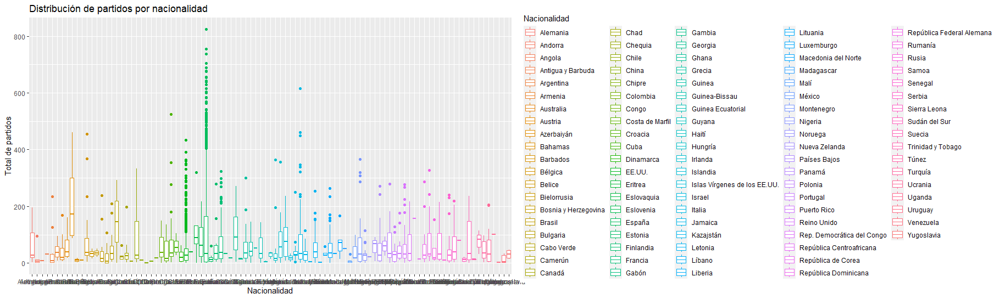

\sffamily

\LARGE \textbf{(6585) Análisis Estadístico Multivariante}

\vspace{1mm}

\LARGE \textbf{Grado en Ciencia e Ingeniería de los Datos}

\vspace{1mm}

\LARGE \textbf{Facultad de Informática}

\vspace{1mm}

\large \textbf{Curso 2023-24} \noindent

\vspace{13mm}

\Huge \textbf{Práctica: Trabajo AEM} \vspace{3mm} \renewcommand{\contentsname}{} \normalsize

```{=tex}
\vspace{-13mm}
\tableofcontents
```
```{=tex}
\rmfamily
\large
```
\section{Introducción al conjunto de datos}

Este dataset abarca las estadísticas de los jugadores de la ACB desde la temporada 1983-1984 a la temporada 2022-2023 y consta de 10742 filas y 37 columnas. Los datos se han recopilado a nivel de temporada, es decir, cada fila representa el rendimiento general del jugador en la temporada en cuestión. Además, se incluyen diversos datos personales o biográficos del jugador, como su nombre completo, altura, fecha y lugar de nacimiento. En cuanto a los datos estadísticos, estos resumen el desempeño del jugador a lo largo de la temporada, incluyendo, entre otros, el número de partidos que ha jugado, el total de minutos, puntos, asistencias, rebotes, etc.

\section{Tratamiento de los datos}

Primero de todo vamos a importar nuestros datos:

```{r}
acb <- read.csv("../data/acb_datos_jugadores_1983_2022.csv")
```

Si observamos los nombres de las columnas del dataset

```{r}
tail(colnames(acb))
```

podemos observar que hay muchos campos diferentes para analizar y de hecho hay una columna cuyo nombre es "X..." y no se explica por ningún lado su significado, así que la vamos a eliminar

```{r, results = 'hide'}
acb <- acb[,-34] 
print(colnames(acb))
```

Pasamos a ver el tipo de datos que tenemos en las variables con:

```{r}
str(head(acb))
```

Podemos observar que las características que son de porcentaje son de tipo "chr", así que las pasaremos a "num". De igual manera, "Total.puntos" es de tipo "num" así que lo vamos a pasar a "int" y "Altura" es de tipo "chr" así que lo vamos a pasar a "num":

```{r, message=FALSE, warning=FALSE}

library(dplyr)

acb <- acb |>
  mutate_at(vars(starts_with("Porcentaje")), 
            funs(as.numeric(gsub("([%,])", "", .))/1000))

acb$Total.puntos <- as.integer(acb$Total.puntos)

acb <- acb |>
  mutate_at(vars(starts_with("Altura")), 
            funs(as.numeric(gsub("([m,])", "", .))/100))

```

Finalmente podemos ver que la columna de los minutos no tiene mucha coherencia, pues los jugadores con muchos partidos tienen uno y pico minutos jugados, mientras que hay otros que tienen novecientos. Esto ocurre porque el que creó el dataset los introdujo mal, así que para arreglarlo podemos darnos cuenta de que cuando se juegan menos de 1000 minutos se pone en formato "número_minutos.000" mientras que si se han jugado 1000 o más minutos se pone como si el número de minutos se hubiera dividido entre mil.

Para arreglarlo hacemos lo siguiente:

```{r}
# Aplicar la condición: si número de partidos >= 25 y minutos están entre 1 y 2,
#multiplicar por 1000; de lo contrario, mantener el valor original
acb$Total.minutos.jugados <- ifelse(acb$Número.de.partidos >= 25 & acb$Total.minutos.jugados >= 1 & acb$Total.minutos.jugados < 2,
                           acb$Total.minutos.jugados * 1000,
                           acb$Total.minutos.jugados)
```

Nótese que hemos utilizado el hecho de que para jugar 1000 minutos, mínimo hemos tenido que jugar 25 partidos (40 minutos completos cada partido). En realidad este número podría variar, porque puede haber prórrogas, pero mirando el dataset parece haber funcionado.

Me he dado cuenta de otro error del dataset, cuando estaba ya terminando el trabajo. Así que cuando lleguemos a la parte de regresión mencionaré cómo me he dado cuenta. Pero el problema es básicamente que las columnas de "Número.de.balones.perdidos" y "Número.de.balones.recuperados" están intercambiadas. Así que simplemente, intecambiaremos los nombres de las columnas así:

```{r}
acb <-  acb |>
          rename(
          Número.de.balones.perdidos = Número.de.balones.recuperados,
          Número.de.balones.recuperados = Número.de.balones.perdidos
        )

```

Finalmente vamos a quitar los jugadores que tienen altura cero, pues no es una gran cantidad del total de datos y nos permitirá hacer mejores regresiones:

```{r}
acb <- acb[acb$Altura != 0, ]
```


Ahora vamos a dividir el dataset en varios diferentes, para poder manejarlo mejor y tener pequeños datasets más "especializados":

```{r, results = 'hide', message=FALSE}

acb_jugador_hist <- acb |>
  group_by(Nombre, Posición, Altura, Lugar.de.nacimiento, Fecha.de.nacimiento,
           Nacionalidad) |>
  summarise(total_partidos = sum(Número.de.partidos), 
            total_minutos = sum(Total.minutos.jugados), 
            total_titular = sum(Número.de.partidos.en.alineación.inicial),
            total_puntos = sum(Total.puntos),
            max_puntos = max(Máximo.de.puntos),
            total_triple_anotados = sum(Tiros.de.3.puntos.anotados),
            total_triple_intentados = sum(Tiros.de.3.puntos.intentados),
            porcentaje_triple = mean(Porcentaje.de.acierto.tiros.de.3.puntos),
            total_dos_anotados = sum(Tiros.de.2.puntos.anotados),
            total_dos_intentados = sum(Tiros.de.2.puntos.intentados),
            porcentaje_dos = mean(Porcentaje.de.acierto.tiros.de.2.puntos),
            total_tl_anotados = sum(Tiros.libres.anotados),
            total_tl_intentados = sum(Tiros.libres.intentados),
            porcentaje_tl = mean(Porcentaje.de.acierto.tiros.libres),
            total_rbo = sum(Número.de.rebotes.ofensivos),
            total_rbd = sum(Número.de.rebotes.defensivos),
            total_rb = sum(Total.rebotes),
            total_asis = sum(Total.asistencias),
            total_bal_per = sum(Número.de.balones.perdidos),
            total_bal_rec = sum(Número.de.balones.recuperados),
            total_tapones_real = sum(Número.de.tapones.realizados),
            total_tapones_rec = sum(Numero.de.tapones.recibidos),
            total_mates = sum(Número.de.mates),
            total_faltas_real = sum(Número.de.faltas.realizadas),
            total_faltas_rec = sum(Número.de.faltas.recibidas),
            valoracion_pro = mean(Valoración),
            total_ganados = sum(Partidos.ganados),
            total_perdidos = sum(Partidos.perdidos)
            )

```

Vamos a ver si se ha realizado bien la transformación:

```{r}
head(acb_jugador_hist)
```

Así, tenemos ya terminada el primer conjunto de datos que utilizaremos para hacer el análisis, que es básicamente un histórico desde la temporada 1983-1984 hasta la temporada 2022-2023 de todos los jugadores de la ACB.

Ahora vamos a construir un segundo conjunto de datos que tendrá los datos de la última temporada registrada (la 2022-2023):

```{r, results = 'hide'}
acb_2022_2023 <- acb[acb$Temporada == "22-23", ]
head(acb_2022_2023)
```

\section{Análisis de los datos}

\subsection{Análisis inicial de los datos}

Primero calculamos varias medidas descriptivas sobre las variables:

```{r}
summary(acb_jugador_hist)
```

Obtenemos toda esta retahíla de datos, pero si nos fijamos en algunos de ellos podemos ver primero de todo que entre la temporada 1983-1984 y la 2022-2023 han jugado un total de 3431 jugadores en la ACB (aparecen 3398 porque hemos filtrado los que no tenían altura).

Otro dato interesante es la media de altura, que confirma que para los jugadores de baloncesto son bastante altos, con una altura media de 1.985 metros.

También vemos que las variables van en rangos muy distintos, esto nos servirá más tarde cuando tengamos que emplear distintas técnicas para las cuales estandarizaremos los datos.

El máximo de minutos que ha jugado un jugador entre estas temporadas ha sido de 20212 minutos. Lo que son unas 336,86 horas. Podemos buscar este jugador con "View(acb_jugador_hist)" y ordenando. Vemos que este jugador es Alberto Oliver Campos. Así podemos buscar también sus estadísticas:

```{r}
jug_mas_min <- acb_jugador_hist %>%
  filter(total_minutos == 20212)

print(jug_mas_min)
```

Vemos también que la media del total de partidos jugados es 74.94 y que la media del total de puntos es 631.78, así que la media de puntos por partido es 631.78/74.94 = 8,4305 puntos/partido.

Podemos hacer también un diagrama de caja-bigotes para ver los rangos en los que se mueven nuestras variables:

```{r}
boxplot(acb_jugador_hist[,-c(1,2,4:6)])
```

No podemos decir mucho de las variables en particular, pero lo que sí que podemos decir es que en general hay una grandísima cantidad de datos atípicos. Parece indicar que hay muchos jugadores que se salen de la norma "por arriba", estos son los grandes jugadores. Vamos a ver el diagrama de la tercera variable que aparece:

```{r}
boxplot(acb_jugador_hist[,8])
```

Esta variable es el total de minutos jugados, la linea central de la caja es la mediana, que si buscamos en el "summary" de arriba podemos ver que es 550. A partir del 5000 (más o menos), los datos ya se consideran outliers y vemos que hay un gran número de jugadores que superan este número, de hecho podemos calcular cuantos jugadores superan los 5000 minutos:

```{r}
mas_5000 <- sum(acb_jugador_hist$total_minutos > 5000)

cat("El número de jugadores con más de 5000 minutos jugados es:", mas_5000)
```

Teniendo en cuenta que tenemos 3398 jugadores, el número de datos atípicos en esta variable representa más o menos el 9.3% de los datos.

Podemos también graficar el número de puntos totales por altura:

```{r, eval = FALSE}
library(tidyverse)

acb_jugador_hist |>
  ggplot(aes(x = Nacionalidad, y = total_partidos)) +
  geom_boxplot(aes(color = Nacionalidad)) +
  labs(title = "Distribución de partidos por nacionalidad",
       x = "Nacionalidad",
       y = "Total de partidos")
```



Ocurre una cosa curiosa, y es que el país cuya caja-bigotes está más alta es la de Azerbaiyán, luego también podemos observar que hay dos paises con muchos atípicos, el que tiene menos es EEUU y el que más tiene es España.

Esto nos indica que los jugadores que más partidos tienen a sus espaldas son los españoles como era de esperar, pero los siguientes son los estadounidenses, lo cuál es normal, ya que en EEUU están los mejores jugadores de baloncesto y es normal que los equipos busquen a estos jugadores.

Antes de seguir vamos a ver los jugadores de Azerbaiyán para ver qué tienen de especial:

```{r}
azerbaiyanos <- acb_jugador_hist[acb_jugador_hist$Nacionalidad == "Azerbaiyán", ]
print(azerbaiyanos)
```

Vemos que son 4 jugadores nacidos en EEUU, nacionalizados con Azerbaiyán con bastantes partidos en ACB. Ahora sí que cuadra lo que mostraba la gráfica: parece que la selección de Azerbaiyán busca jugadores estadounidenses en ACB para "ficharlos".

Vamos a probar hacer un plot para ver cómo se correlacionan los datos, pero no de todas las variables porque sería muy costoso computacionalmente y difícil de visualizar:

```{r}
plot(acb_jugador_hist[,c(3,7:11)],pch=20,cex=0.8)
```

Observamos que aparecen gráficas que se asemejan a la forma de una flecha. Esto indica fuertes dependencias entre la variables. Estas dependencias van de menos a más si partimos desde la base y vamos a la punta.

Vemos también que cuando "max_puntos" está en el eje X y "total" está en el eje Y obtenemos una gráfica que se asemeja a la distribución normal. Esto tiene sentido, pues hay muy pocos jugadores que tienen un mínimo de puntos muy bajo o un mínimo de puntos muy alto. Además ocurre algo curioso, los jugadores con un máximo de puntos alto, ha estado poco tiempo en la ACB, pues de haber pasado más tiempo sus totales estarían más altos. Esto puede ser señal de que al ser tan buenos, han sido fichados por equipos de mejores ligas y ya han permanecido en esas ligas el resto de su carrera.

Ahora podemos hacer un plot para ver mejor cómo se relaciona la altura con el número total de puntos en concreto:

```{r}
plot(acb_jugador_hist[,c(3,10)],pch=20,cex=0.8)
```

Vemos que hay muchos jugadores que han metido pocos puntos. Conforme vamos subiendo el número de puntos el número de jugadores decrece hasta llegar a la punta de la normal, donde ya solo hay un único jugador.

Observamos que los jugadores más altos no son necesariamente los que más puntos meten, pues de ser así la curva estaría inclinada a la derecha. En cambio parece ser bastante simétrica, lo que indica que los jugadores con una altura "normal" (en el contexto del baloncesto) meten más puntos.

\subsection{PCA (Análisis de las Componentes Principales)}

Para hacer el análisis de las componentes principales usaremos la matriz de correlaciones, pues tenemos datos con rangos muy diferentes y unidades diferentes. Haciendo esto conseguimos estandarizar las variables y que las unidades de medida desaparezcan.

Ahora vamos a hacer un dataframe con solamente las variables que tengan datos numéricos para poder hacer el PCA:

Empezaremos haciendo el PCA al dataset de 'acb_jugador_hist'

```{r, results = 'hide'}
#Vemos los tipos de columnas por si hay que eliminar alguna
tipos_columnas <- lapply(acb_jugador_hist, typeof)
print(tipos_columnas)
```

```{r}
#Eliminamos las que no son de tipo numérico
datos_pca_hist <- acb_jugador_hist[,-c(1,2,4:6)] 
```

Ahora hacemos el PCA:

```{r}
PCA_hist<-princomp(datos_pca_hist,cor=TRUE)
summary(PCA_hist,loadings=TRUE)
```

Si nos fijamos en la fila que pone 'Cumulative Proportion' podemos ver que la primera componente principal tiene aproximadamente el 64.56% de la información. Y si cogemos las tres primeras componentes principales llegamos al 81.58%. Es decir, estamos resumiendo el 81.58% de la información de 29 variables en solamente 3 variables.

Ahora podemos pasar a analizar los loadings o cargas de la primera componente principal para ver qué es lo que esta representa. Podríamos observar los datos de arriba, pero para hacerlo más sencillo vamos a imprimir solamente los datos correspondientes a la primera componente principal:

```{r}
PCA_hist$loadings->L_hist
L_hist[,1]
```

Podemos observar que la altura y los porcentajes no se tienen prácticamente en cuenta, en cambio el total de cada estadística está más o menos al 20% cada una. Lo que esto quiere indicar es que la primera componente principal nos dice los jugadores que tienen todas sus estadísticas altas (sin tener en cuenta sus porcentajes). Por lo que si buscamos un jugador que haya jugado mucho y haya hecho muchos puntos, asistencias, rebotes... tendrá un valor alto en esta componente. Vamos a comprobarlo:

Vamos primero a buscar por ejemplo en el dataset a Sergio Llull:

```{r}
library(dplyr)

sergio_llull <- acb_jugador_hist %>%
  filter(grepl("Llull", Nombre))

print(sergio_llull)
```

```{r}
which(acb_jugador_hist$Nombre == "Sergio  Llull Meliá")
```

Así podemos saber el número que ocupa Sergio Llull en el dataset, ahora lo único que queda es ver el score que este tiene en la primera componente:

```{r}
PCA_hist$scores->S_hist
S_hist[2991,1]
```

Podemos comprobar que si ponemos a los 20 primeros jugadores ninguno de estos le supera:

```{r}
S_hist[1:20,1]
```

De hecho, podríamos buscar el jugador que tiene el score más alto en la primera componente. Antes de ejecutar ya podemos suponer que nos va a salir un jugador histórico de la competición con muchos partidos, puntos, minutos...

```{r}
max(S_hist[,1])
acb_jugador_hist[which.max(S_hist[,1]),]
```

Obtenemos que el score más alto es de 35.48703 y vemos que, como ya habíamos predicho, aparece Felipe Reyes.

También podríamos buscar el jugador con "menos intervención" de la competición:

```{r}
min(S_hist[,1])
acb_jugador_hist[which.min(S_hist[,1]),]
```

Tiene un score de -3.341696 y vemos que solamente hay registrado 1 partido y 1 minuto de juego.

Pasamos a analizar la segunda componente principal:

```{r}
L_hist[,2]
```

Esta variable puede ser muy complicada de analizar para alguien que no sepa mucho de baloncesto, pero si te gusta el baloncesto se puede ver claramente lo que esta indica. La segunda componente principal indica los jugadores que juegan en la posición de pívot.

Los pívot tienen las siguientes características: son jugadores altos, generalmente son malos tirando triples pues su fuerte es el juego en la zona (cerca de la canasta), cogen muchos rebotes y hacen muchos tapones (debido a su físico). Además son los que más mates hacen (por su gran altura).

Vamos a hacer lo siguiente para comprobar que nuestras suposiciones son correctas: imprimiremos los 10 jugadores con el score más alto en la segunda componente y vamos a ver la posición en la que juegan:

```{r}
acb_jugador_hist[order(S_hist[,2], decreasing = TRUE)[1:10],]
```

Podemos ver que 8 de los 10 jugadores juegan de pívot y 2 de ala-pívot. Podemos ver que en la segunda posición aparece Tavares, uno de los mejores pívots de europa actualmente. Y en la séptima posición aparece Felipe Reyes, uno de los mejores pívots que ha jugado para España.

De hecho podemos comprobar si es Tavares el que más score obtiene en la segunda componente en la temporada 22-23:

```{r}
datos_pca_22_23 <- acb_2022_2023[,-c(1:3,5:8)] 
PCA_22_23<-princomp(datos_pca_22_23,cor=TRUE)
PCA_22_23$scores->S_22_23
acb_2022_2023[order(S_22_23[,2], decreasing = TRUE)[1:10],c(1,3)]
```

Aparece segundo, pero ahora sí que todos los que aparecen juegan en la posición de pívot.

Pero primero deberíamos de comprobar qué es lo que nos dice la segunda componente principal del df "acb_2022_2023", porque podríamos haber obtenido una cosa completamente diferente:

```{r}
PCA_22_23$loadings->L_22_23
L_22_23[,2]
```

Podemos observar que la altura actualmente se prioriza más y que han mejorado un poco más en el triple aunque siguen siendo malos.

Finalmente vamos a ver qué nos dice la tercera componente:

```{r}
L_hist[,3]
```

En la tercera componente nos indica los jugadores que tienen muy buenos porcentajes pero que en total no tienen una gran cantidad de puntos, ni asistencias, ni rebotes, ni partidos... Lo que quiere indicar que son jugadores muy buenos que han estado poco tiempo en la liga.

Vamos a ver a los 10 primeros:

```{r}
acb_jugador_hist[order(S_hist[,3], decreasing = TRUE)[1:10],]
```

Lo primero que podemos notar es que la mayoría de los jugadores son de estados unidos. Después podemos ver que ninguno de ellos superan los 100 partidos. Pero lo que sí tienen son buenos porcentajes y buena valoración promedio por temporada.

Nótese que el primer jugador que nos aparece es Oscar Schmidt, que era hasta hace poco el jugador con más anotaciones en la historia del baloncesto (49.737 puntos), siendo adelantado este 3 de abril de 2024 por Lebrón James. Vemos que a pesar de no haber pasado mucho tiempo en la ACB (71 partidos) aparece en esta lista por sus grandes porcentajes y valoración, además de una alta puntuación en el máximo de puntos.

Podemos representar gráficamente los scores de las dos primeras componentes principales sin estandarizar de la siguiente manera:

```{r}
plot(S_hist[,1],S_hist[,2],xlab='Y1',ylab='Y2')
```

Notamos que cuando los jugadores no han jugado muchos partidos y no tienen muchas estadísticas (Y1), no pueden ser ni "buenos" ni "malos" pívots en términos de estadísticas (Y2) pues no han podido jugar suficientes minutos.

En cambio, conforme nos desplazamos para la derecha podemos ver que empiezan a aparecer "buenos" y "malos" pívots, ya que tienen sufientes estadísticas para ser calificados.

Ahora veamos lo que sucede con Y1 e Y3:

```{r}
plot(S_hist[,1],S_hist[,3],xlab='Y1',ylab='Y3')
```

Es curioso, la gráfica parece indicar que los jugadores que pasan menos tiempo en la liga son los que mejores porcentaje tienen. Aunque esto es engañoso, porque las cargas de Y3, aunque no con mucha intensidad, perjudican a los jugadores con buenas estadísticas, por lo que a la larga tienen su efecto conforme incrementamos en el eje de Y1.

También podemos ver cuales son las variables mejor representadas de cada componente con las saturaciones:

```{r}
SAT_hist<-cor(datos_pca_hist,S_hist)

cat("La variable mejor representada en Y1 es",
    rownames(SAT_hist)[which.max(SAT_hist[,1])], "\nManteniendo un", max(SAT_hist[,1])^2, "de su información\n")

cat("La variable mejor representada en Y2 es", rownames(SAT_hist)[which.max(SAT_hist[,2])], "\nManteniendo un", max(SAT_hist[,2])^2, "de su información\n")

cat("La variable mejor representada en Y3 es", rownames(SAT_hist)[which.max(SAT_hist[,3])], "\nManteniendo un", max(SAT_hist[,3])^2, "de su información")

```

Vemos que todas ellas tienen sentido, pues Y1 nos indica los jugadores con estadísticas altas (y por tanto muchos minutos jugados), Y2 nos indica los jugadores que juegan de pívot (por lo que harán muchos tapones) e Y3 nos dice los jugadores que son buenos pero no han estado mucho tiempo (buenos porcentajes).

Para terminar con esta sección vamos a pintar un gráfico de sedimentación, para emplear la regla del codo para escoger un número óptimo de componentes para algún análisis posterior:

```{r}
plot(eigen(cor(datos_pca_hist))$values,type='l',ylab='Valores  propios')
```

Podemos ver que el codo (los sedimentos) se encuentra en j = 4, por lo que cogeríamos las 3 primeras componentes.

\subsection{Análisis Discriminante}

En el análisis discriminante vamos a utilizar clasificar a los jugadores en la posición en la que deberían jugar según sus características/estadísticas.

Para ello, primero vamos a crear una columna nueva llamada 'num_posicion' para poder realizar los cálculos:

```{r}
mapeo_posiciones <- c(
  'Base' = 1,
  'Alero' = 2,
  'Escolta' = 3,
  'Ala-pívot' = 4,
  'Pívot' = 5,
  'Desconocido' = 10
)

# Crear una nueva columna 'Position_Num' mapeando los valores
acb_jugador_hist$num_posicion <- mapeo_posiciones[acb_jugador_hist$Posición]

#Si no hay valor, es desconocido, por lo que le asignamos el 10
acb_jugador_hist$num_posicion[is.na(acb_jugador_hist$num_posicion)] <- 10

```

Ahora vamos a ver cuál de las variables del dataset es la que mejor separa las clases:

```{r}
boxplot(acb_jugador_hist$Altura~acb_jugador_hist$num_posicion)
```

Podemos ver que nos ha graficado la clase con los jugadores de clase desconocida (ya que no la hemos quitado), así que vamos a volver a hacer el gráfico otra vez, pero sin los jugadores con posición desconocida:

```{r}
sin_desconocidos <- acb_jugador_hist[acb_jugador_hist$num_posicion != 10, ]

boxplot(sin_desconocidos$Altura~sin_desconocidos$num_posicion, ylim=c(1.6,2.3))
```

Vemos que esta variable más o menos consigue diferenciar las clases, aunque ala-pívot y pívot están algo mezcladas.

Primero vamos a ver si las matrices de covarianzas de cada clase son parecidas o no, para así realizar un LDA o un QDA:

```{r}
base<-sin_desconocidos[sin_desconocidos$num_posicion==1,c(3,7:34)]
pivot<-sin_desconocidos[sin_desconocidos$num_posicion==5,c(3,7:34)]

cov(base[1:5])
cov(pivot[1:5])
```

Hemos visto solo las 5 primeras variables, porque para verlas todas es muy complicado. 

Ya con estas se puede apreciar que las matrices no son iguales por lo que hacer LDA no nos daría una buena solución. Así que pasamos a hacer el QDA.

Pero antes de hacerlo tenemos que comprobar que todas las variables sean normales:

```{r}
library(mvnormtest)

#base no devuelve valor porque la matriz es singular (no la puede resolver)
mshapiro.test(t(pivot))
```

Con la primera variable que analizamos ya vemos que esta no es normal, por lo que tampoco podríamos hacer el QDA. 

Aún así vamos a realizar el LDA y el QDA y ver qué obtenemos:

*Inciso: Ya he intentado hacer el LDA con las variables, pero como obtenemos un warning de que las variables están altamente correlacionadas entre sí vamos a emplear las 7 primeras componentes principales.

Para ello haremos lo siguiente:

```{r}
#Guardamos el vector con las etiquetas de los grupos
num_posicion <- sin_desconocidos$num_posicion
#Construimos el PCA, pero ahora sin los desconocidos
PCA_sindesc <- princomp(sin_desconocidos[,c(3,7:34)],cor=TRUE)
S_sindesc <- PCA_sindesc$scores
#Construimos un tibble con las componentes principales y una columna para los grupos
comp_princ <- as_tibble(S_sindesc[, 1:7])
comp_princ$num_posicion <- num_posicion

comp_princ
```

```{r}
library(MASS)
LDA_sindesc<-lda(comp_princ[,1:7],comp_princ$num_posicion,prior=c(1/5,1/5,1/5,1/5,1/5), CV=TRUE)

t <- table(comp_princ$num_posicion,LDA_sindesc$class)
accuracy <- (t[1,1] + t[2,2] + t[3,3] + t[4,4] + t[5,5])/ sum(t)
t 
cat("El accuracy es de:", accuracy)
```
Podemos ver que hace una clasificación algo mala, de más o menos el 63%, aunque algo sí que predice. Lo podemos ver gráficamente con:

```{r}
#Volvemos a pone LDA_sindesc pero ahora sin CV=TRUE para que funcione
LDA_sindesc<-lda(comp_princ[,1:7],comp_princ$num_posicion,prior=c(1/5,1/5,1/5,1/5,1/5))
predict(LDA_sindesc,comp_princ[,1:7])->P
plot(P$x, pch = as.integer(comp_princ$num_posicion), col = comp_princ$num_posicion)
legend('bottomright',legend=c('Base','Alero','Escolta', 'Ala-pívot','Pívot'),pch=1:5)
```

Vemos que la variable LD1 separa más o menos los datos, mientras que LD2 no parece hacer mucho.

Se comprobamos que todos grupos se superponen unos con otros, aunque sí que se puede ver cierta separabilidad. También vemos que la clase que más parece diferenciarse es la de base. 

Obtenemos el accuracy del QDA:

```{r}
QDA_sindesc<-qda(comp_princ[,1:7],comp_princ$num_posicion,
                 prior=c(1/5,1/5,1/5,1/5,1/5), CV = TRUE)

t2 <- table(comp_princ$num_posicion,QDA_sindesc$class)
accuracy2 <- (t2[1,1] + t2[2,2] + t2[3,3] + t2[4,4] + t2[5,5])/ sum(t2)
t2 
cat("El accuracy es de:", accuracy2)
```

Vemos que el QDA es todavía peor, por lo que no merece la pena analizarlo más en profundidad.

\subsection{Análisis cluster}

\subsubsection{Cluster con K-means}

Vamos a intentar agrupar los datos en 5 clusters para ver si consigue encontrar las posiciones en las que juegan los jugadores:

```{r, results = 'hide'}
#Estandarizamos los datos
ds <- as.data.frame(scale(sin_desconocidos[,c(3,7:34)]))
#Inicializamos el número de centros a 5
CA1<-kmeans(ds,centers=5,nstar=10)
```

Si queremos ver el número de coincidencias entre la clasificación que ha hecho y la que nosotros ya teníamos podemos hacer:

```{r}
Y<-CA1$cluster
aciertos <- sum(Y==sin_desconocidos$num_posicion)
cat("Coinciden en un", 100*aciertos/nrow(sin_desconocidos), "%")
```

Así podemos ver que claramente no nos ha hecho el agrupamiento por las posiciones, ya que solamente acierta en el 16.84% de las veces.

Vamos a representar los grupos:

```{r}
plot(comp_princ[,1:2],col=CA1$cluster,pch=20)
```

Vemos que parte la "flecha" primero en tres trozos, siendo un grupo la punta de esta y finalmente parte la "cola" en otros dos grupos.

```{r}
CA1$withinss
```

Estas son las sumas de las distancias al cuadrado de todos los puntos a los centroides de cada grupo. Vemos que el tercer grupo (el azul celeste) tiene un centroide que es el que mejor actúa como centro de gravedad para los puntos.

Podemos calcular cuánto hemos reducido la variabilidad de los datos al hacer esta agrupación:

```{r}
1-CA1$tot.withinss/CA1$totss
```

Hemos reducido la variabilidad en un 65.21%.

No obtenemos una muy buena agrupación de los datos. Esto es porque hemos fijado el número de grupos, pero con el agrupamiento jerárquico podemos encontrar el óptimo.

\subsubsection{Cluster jerárquico}

Volvemos a calcular un agrupamiento de 5 clusters, pero ahora con este algoritmo.

Antes de eso, vamos a hacer un mapa de calor para ver la "cercanía" de los datos.

```{r}
D <- dist(ds[1:200,], method = 'euclidean')
M<-as.matrix(D)
heatmap(M)
```

Hacemos el mapa de calor de los primeros 200 datos, porque si lo hacemos de todo va a tardar demasiado.

Podemos ver en la zona de la izquierda que hay unos cuantos datos que se encuentran muy alejados y a medida que nos movemos hacia la derecha encontramos datos que están muy juntos.

Volvemos a hacer 5 clusters pero ahora con el método jerarquizado:

```{r}
D <- dist(ds, method = 'euclidean')
M<-as.matrix(D)
CA2<-hclust(D,method='complete')
grupos<-cutree(CA2, k=5)
```

Vamos a comprobar si con este algoritmo obtenemos resultados parecidos al anterior:

```{r}
aciertos <- sum(grupos==Y)
cat("Coinciden en un", 100*aciertos/length(Y), "%")
```

Se puede ver que ha formado grupos completamente diferente, vamos a verlo gráficamente:

```{r}
plot(comp_princ[,1:2],col=grupos,pch=20)
```
Obtenemos ahora un grupo enorme que constituye la punta de la "flecha" y luego unos grupillos más pequeños de unos pocos individuos. No vamos a ver el accuracy con las etiquetas de posición porque ya gráficamente se puede ver que no va a funcionar. 

Se puede apreciar claramente cómo funciona cada algoritmo: el cluster con K-means ha agrupado los datos intentando repartir equitativamente los datos para cada centroide, mientras que el cluster jerárquico ha preferido hacer grupos donde tenemos una gran densidad de puntos. Esto es debido a que el cluster de K-means parte de unos centroides inicializados aleatoriamente y luego los va ajustando según la media, mientras que el jerárquico va agrupando los datos más cercanos, consiguiendo así formar grupos más compactos.

\subsubsection{Número óptimo de clusters}

Para intentar deducir el número óptimo de grupos a tomar podemos hacer lo siguiente:

```{r}
#library(NbClust)
#NbClust(ds,method='complete',index='all')$Best.nc
#Este no funciona porque la matriz TSS es indefinida.

library(cluster)
gap<-clusGap(ds,FUNcluster=kmeans,K.max=5) #Recomiendo no volver a ejecutar 
                                           #esta celda porque tarda mucho
gap

```
El valor máximo del GAP es 1.584221 y se obtiene para k = 5. Para representarlo podemos hacer:

```{r, message=FALSE}
plot(gap$Tab[,3],type='b',xlab='k',ylab='GAP') 
library(ggplot2)
library(factoextra)
fviz_gap_stat(gap)
```

El estadístico GAP compara el total de las distancias intra-cluster para diferentes valores de k. Nótese que la técnica que hemos utilizado para calcular los grupos es k-means, por lo que si utilizamos otra podríamos obtener resultados diferentes. Además parece que el estadístico GAP tiene una tendencia a seguir creciendo, por lo que convendría aumentar el k máximo para poder encontrar el máximo. Pero no lo vamos a hacer porque tarda demasiado en calcular los resultados.

\subsection{Regresión}

\subsubsection{Regresión lineal múltiple}

Vamos a intentar predecir la fórmula de la valoración de un jugador en la temporada 2022-2023 según sus estadísticas.

Para ello, primero de todo vamos a estudiar un poco cómo se comporta la variable a predecir:

```{r}
boxplot(acb_2022_2023$Valoración, xlab = "Valoración")
```

No parece tener ningún atípico, lo cuál es buena señal para hacer buenas predicciones. Continuamos el análisis estudiando la normalidad:

```{r}
shapiro.test(acb_2022_2023$Valoración)
qqnorm(acb_2022_2023$Valoración)
qqline(acb_2022_2023$Valoración)
```

Claramente no es normal, ya que obtenemos un p-valor de 5.903e-11 y se puede ver en los gráficos que el extremo izquierdo no se ajusta nada.

Primero vamos a crear el modelo con todas las variables, para luego disminuir el número mediante los métodos de selección de regresores backward, fordward y stepwise.

```{r}
modelo_completo <- lm(acb_2022_2023$Valoración~., data = acb_2022_2023[,c(4,9:36)])
```

Ahora aplicamos los métodos:

```{r, results = 'hide', warning=FALSE}
modelo_cte <- lm(acb_2022_2023$Valoración ~ 1, data = acb_2022_2023[,c(4,9:36)])

modelo_backward <- step(modelo_completo, direction = "backward")
modelo_stepwise <- step(modelo_cte, direction = "both", 
                        scope = formula(modelo_completo))
modelo_forward <- step(modelo_cte, direction = "forward", 
                       scope = formula(modelo_completo))
```

Si nos ponemos a ver cada uno por separado vemos que el más simple es el forward y el stepwise, que obtienen ambos el siguiente modelo:

```{r}
modelo_forward$coefficients
```
Aquí es donde me di cuenta del error sobre que las columnas "Número.de.balones.perdidos" y "Número.de.balonces.recuperados" estaban intercambiadas. Pues por balones recuperados le quitaban puntuación al jugador, mientras que por balones perdidos le añadían puntuación (lo cuál no tiene sentido). 

Vemos que tanto el intercepto como el número de partidos es prácticamente cero. Aunque ocurre una cosa un tanto extraña, pues mientras que vemos que todas las variables tienen un coeficiente de más y menos uno. En las variables "Total.puntos", "Tiros.libres.anotados" y "Tiros.de.2.puntos.anotados" tenemos coeficientes de 4/3, 2/3 y 1/3 respectivamente.

Podemos buscar la fórmula en internet para ver que es:

Valoración=(Puntos+Rebotes+Asistencias+Robos+Tapones)-(Tiros_de_Campo_Fallados+Tiros_Libres_Fallados+Tapones_Recibidos+Pérdidas+Faltas_Realizadas)

Podemos hacer las siguientes cuentas para llegar a nuestra fórmula y ver que efectivamente, son la misma:

(1) Tiros_de_Campo_Fallados = Tiros.de.3.puntos.intentados + Tiros.de.2.puntos.intentados - Tiros.de.3.puntos.anotados - Tiros.de.2.puntos.anotados

(2) Total.puntos = 3\*Tiros.de.3.puntos.anotados + 2\*Tiros.de.2.puntos.anotados + Tiros.libres.anotados <=> 
1/3\*Total.puntos = Tiros.de.3.puntos.anotados + 2/3\*Tiros.de.2.puntos.anotados + 1/3\*Tiros.libres.anotados <=>
Tiros.de.3.puntos.anotados = 1/3\*Total.puntos - (2/3\*Tiros.de.2.puntos.anotados + 1/3\*Tiros.libres.anotados)

Si ahora sustituimos en (1) tenemos que:

(1) Tiros_de_Campo_Fallados = Tiros.de.3.puntos.intentados + Tiros.de.2.puntos.intentados - (1/3\*Total.puntos - (2/3\*Tiros.de.2.puntos.anotados + 1/3\*Tiros.libres.anotados)) - Tiros.de.2.puntos.anotados <=>
Tiros_de_Campo_Fallados = - 1/3\*Total.puntos + Tiros.de.3.puntos.intentados + Tiros.de.2.puntos.intentados - 1/3\*Tiros.de.2.puntos.anotados + 1/3\*Tiros.libres.anotados 

También sabemos que:

(3) Tiros.libres.intentados = Tiros.libres.anotados - Tiros_Libres_Fallados <=>
Tiros_Libres_Fallados = Tiros.libres.intentados - Tiros.libres.anotados

Si sustituimos "Tiros_de_Campo_Fallados" y "Tiros_Libres_Fallados" en la fórmula de Valoración, obtendremos exactamente los coeficientes de los regresores.

Es curioso ver, que al no crear una variable llamada "Tiros.de.x.fallados" el regresor ha hecho los cálculos empleando combinaciones lineales de esta variable no creada.

Podemos ver los estadísticos del modelo creado: 

```{r, results = 'hide'}
summary(modelo_forward)
```

Vemos que obtiene la fórmula perfectamente, pues el R cuadrado es de 1.También podemos observar que todos los regresores son significativos (aunque realmente podríamos quitar tanto el intercepto como el número de partidos, ya que están muy cerca de cero).

Si intentamos predecir el valor de un nuevo individuo, lo que hará la recta de regresión será actuar como una calculadora de la valoración de un jugador en una temporada, por ejemplo:

```{r}

nuevo <- data.frame(
  Total.puntos = 100,
  Total.rebotes = 20, 
  Total.asistencias = 30,  
  Número.de.faltas.realizadas = 10,  
  Tiros.de.3.puntos.intentados = 15, 
  Tiros.de.2.puntos.intentados = 50, 
  Número.de.balones.perdidos = 5, 
  Número.de.faltas.recibidas = 7, 
  Tiros.libres.intentados = 10,  
  Número.de.tapones.realizados = 2,  
  Número.de.balones.recuperados = 4,  
  Numero.de.tapones.recibidos = 6, 
  Tiros.libres.anotados = 7,  
  Tiros.de.2.puntos.anotados = 40,  
  Partidos.ganados = 20  
)

resultado <- predict(modelo_forward, newdata = nuevo, interval = "prediction",
                     level = 0.95)
resultado
```

Obtenemos una valoración de  118.3333, además, hemos puesto un intervalo de confianza al 95%, pero como tenemos una bondad de ajuste de 1, obtenemos que el límite superior y el inferior coinciden. Esto es por lo que he dicho más arriba: estamos seguros que el valor que nos vaya a salir va a ser el correcto.

Podríamos validar el modelo, pero tampoco lo vamos a hacer, ya que ya sabemos que esa es la fórmula que nos tiene que salir.

\subsubsection{Regresión Multinomial}

En esta sección vamos a tratar de hacer Regresión Multinomial como un problema de clasificación. De nuevo vamos a intentar predecir la posición en la que juegan los jugadores, ya que en casos anteriores no hemos conseguido obtener buenos resultados.

Para ello vamos a empezar pasando la variable "Posición" a tipo factor:

```{r}
sin_desconocidos$Posición <- factor(sin_desconocidos$Posición)
```

Aunque primero, vamos a hacer una "poda" de las variables que tengan mucha correlación para tratar de reducir el número de variables. Esta reducción de variables la hacemos porque es mejor tener regresores que no estén muy correlados y además nos ayuda para que más tarde, cuando creemos el modelo, la red neuronal no tenga un número tan grande de pesos que calcular.

```{r}
# Calcula la matriz de correlación
tmp <- cor(sin_desconocidos[, c(3, 7:34)])

# Establece la parte superior de la matriz a cero
tmp[upper.tri(tmp)] <- 0

# Establece la diagonal a cero (opcional)
diag(tmp) <- 0

# Crea un nuevo conjunto de datos sin las variables altamente correlacionadas
column_names <- colnames(tmp)[colSums(tmp > 0.95) == 0]
```

Como vamos a emplear el modelo como clasificador, vamos a partir el dataset en train y test. Para poder más tarde hacer una correcta valoración del modelo. 

```{r}
set.seed(31416)
indices_entrenamiento <- sample(1:nrow(sin_desconocidos), 0.8*nrow(sin_desconocidos))

datos_entrenamiento <- sin_desconocidos[indices_entrenamiento,c(column_names,"Posición")]
datos_test <- sin_desconocidos[-indices_entrenamiento,c(column_names,"Posición")]
```


Vamos a comenzar usando un modelo multinomial que tenga todos los predictores, para luego tratar de reducir este número de variables mediante los métodos de selección de regresores. 

Tomaremos como clase de referencia la posición "Pívot". 

```{r, results = 'hide'}
library("nnet")
datos_entrenamiento$Posición <- relevel(datos_entrenamiento$Posición, ref = "Pívot") 
mymultinom <- multinom(Posición ~ ., data = datos_entrenamiento)
```

Podemos ver el modelo obtenido haciendo: 

```{r, results = 'hide'}
summary(mymultinom)
```
Podemos fijarnos en las medidas para la bondad del ajuste para ver si luego, cuando apliquemos los otros métodos, se reducen. 

- Residual Deviance: 3668.151 
- AIC: 3844.151 

Continuamos ahora empleando los tres métodos de reducción de variables:

```{r, results = 'hide'}
modelo_backward <- step(mymultinom, direction = "backward")
```

```{r}
summary(modelo_backward)
```


En este caso reducimos en número de variables a 17, vamos a ver los siguientes. Y obtenemos las siguientes medidas:

- Residual Deviance: 3681.472 
- AIC: 3825.472 

Reduciendo un poco más el valor del criterio de Akaike, pero aumentando la devianza.

```{r, results = 'hide'}
modelo_nulo <- multinom(Posición ~ 1, data = datos_entrenamiento)
modelo_forward <- step(modelo_nulo, scope = formula(mymultinom), direction = "forward")
```

```{r}
summary(modelo_forward)
```

Este modelo consigue reducir aún más el número de variables, en este caso a 15. Obtenemos las siguientes medidas:

- Residual Deviance: 3724.844 
- AIC: 3852.844 

Aunque aumenta el valor de ambas medidas para la bondad de ajuste.

```{r, results = 'hide'}
modelo_stepwise <- step(modelo_nulo, scope = formula(mymultinom), direction = "both")
```

```{r}
summary(modelo_stepwise)
```

De nuevo obtenemos 15 variables, en este caso las medidas son las mismas que las del modelo forward.

De hecho, si nos fijamos, nos daremos cuenta que han devuelto el mismo modelo.

De esta manera, obtenemos dos modelos diferentes, uno que tiene 15 variables pero peores medidas de bondad del ajuste. Y otro con 17 y medidas algo parecidas de bondad del ajuste.

Yo voy a escoger el modelo backward, ya que es un modelo que es más o menos igual de bueno que el multinomial y además consigue reducir el número de variables a 17.

Ahora vamos a comprobar si el modelo es significativo, para ello ejecutaremos los siguientes comandos:

```{r}

diferencia_devianzas <- modelo_nulo$deviance - modelo_backward$deviance

grados_libertad <- nrow(datos_entrenamiento) - 1 - (nrow(datos_entrenamiento) - 17 -1)

p_valor <- pchisq(diferencia_devianzas, df = grados_libertad, lower.tail = FALSE) 
p_valor
```

Recordemos que los grados de libertad para el modelo nulo se corresponden con n - 1 (tamaño de la muestra menos 1) y los grados de libertad para el modelo completo secorresponden con n - k - 1 (tamaño de la muestra menos número de coeficientes de regresión)

Obtenemos un p-valor de cero, por lo que podemos concluir que el modelo backward es significativo.

Podemos ver los coeficientes de los parámetros de regresión sobre los odds:

```{r}
exp(coef(mymultinom))
```
Nótese que todos los coeficientes de las diferentes posiciones son muy parecidos, lo que parece indicar que no va a poder hacer regresión muy bien, aún así, vamos a comprobarlo.

```{r}
pos_predict <- predict(modelo_backward, newdata = datos_test, "class") 
test_predict <- cbind(datos_test, pos_predict)

#Cambiamos el nombre de la columna porque por defecto le da "...23"
column_index <- which(colnames(test_predict) == "...23")
colnames(test_predict)[column_index] <- "pos_predict"

matriz_confusion <- table(test_predict$Posición, test_predict$pos_predict, 
                          dnn = c("real",  "predicho"))
matriz_confusion
```
Si queremos "ordenar" esta matriz, podemos hacer:

```{r}
matriz_confusion <- matriz_confusion[order(rownames(matriz_confusion)),
                                     order(colnames(matriz_confusion))]


print(matriz_confusion)

```
Me ha sorprendido bastante el acierto, pues como he dicho antes, los coeficientes en muchos de los regresores para las diferentes posiciones eran muy parecidos. Aunque si lo pensamos un poco son muchas variables, y puede ser que aunque los coeficientes sean parecidos, las pequeñas desviaciones hacen la diferencia entre la posición en la que juega un jugador y otra distinta.

Podemos ver ahora las métricas que se generan de la matriz de confusión:

```{r}
accuracy <- sum(diag(matriz_confusion)) / sum(matriz_confusion) 
accuracy
```
Obtenemos un accuracy del 67.95%, que no es que sea muy bueno, pero es mejor que el que hemos obtenido con LDA (63.29%). Tampoco podemos pedir mucho más, porque una persona promedio viendo las estadísticas (sin conocer al jugador) difícilmente tendría ese acierto. Es complejo distinguir entre posiciones como escolta y alero. Y hay jugadores que a veces juegan por ejemplo de escolta y si el base está lesionado, pueden jugar de base.

Teniendo eso en cuenta creo que es un modelo bastante bueno.

Se puede apreciar que el más diferenciable es el base, mientras que el más complicado de acertar es el Ala-pívot.

Finalmente podríamos emplear el modelo para predecir alguno de los jugadores que teníamos marcado como "Desconocido" para ver qué predicción nos da:

```{r}
nuevo_jugador <- acb_jugador_hist[head(which(acb_jugador_hist$num_posicion == 10),1)
                                  , colnames(datos_test)]
```

```{r}
predicción <- predict(modelo_stepwise, newdata = nuevo_jugador, "class") 
predicción
```
Vemos que lo clasifica como pívot. Podemos buscar el nombre del jugador en internet para ver si ha acertado:

```{r}
acb_jugador_hist[head(which(acb_jugador_hist$num_posicion == 10),1), "Nombre"]
```
Si entramos en la siguiente página: https://es.wikipedia.org/wiki/Aleksandr_Belostenny podremos ver que ha acertado, pero eso no es muy difícil, pues es un jugador de 2,14, por lo que no es difícil predecir que sea pívot. Podemos probar con otro:

```{r}
nuevo_jugador2 <- acb_jugador_hist[which(acb_jugador_hist$num_posicion == 10)[2]
                                   , colnames(datos_test)]
predicción <- predict(modelo_stepwise, newdata = nuevo_jugador2, "class") 
predicción
```

```{r}
acb_jugador_hist[which(acb_jugador_hist$num_posicion == 10)[2], "Nombre"]
```
Ha vuelto acertar, se puede mirar en la siguiente página web: https://es.wikipedia.org/wiki/Anthony_Frederick 

Aunque esta vez podría haber fallado, pues si calculamos el número de veces que acierta que es alero cada vez que predice alero podemos ver que no es muy alta:

```{r}
matriz_confusion["Alero", "Alero"]/sum(matriz_confusion[,"Alero"])
```
Podríamos de hecho conseguir un modelo más sencillo, pues si recordamos, muchos de los coeficientes de los regresores eran prácticamente iguales. 
De esta manera podríamos crear un modelo con solamente 4 regresores: altura y pocentajes de 3 puntos, 2 puntos y tiro libre.

```{r, results = 'hide'}
library("nnet")
datos_entrenamiento$Posición <- relevel(datos_entrenamiento$Posición, ref = "Pívot") 
mymultinom2 <- multinom(Posición ~ Altura + porcentaje_triple + porcentaje_dos 
                        + porcentaje_tl, data = datos_entrenamiento)
```

```{r}
summary(mymultinom2)
```

```{r}
pos_predict2 <- predict(mymultinom2, newdata = datos_test, "class") 
test_predict2 <- cbind(datos_test, pos_predict2)

#Cambiamos el nombre de la columna porque por defecto le da "...23"
column_index <- which(colnames(test_predict2) == "...23")
colnames(test_predict2)[column_index] <- "pos_predict"

matriz_confusion2 <- table(test_predict2$Posición, test_predict2$pos_predict
                           , dnn = c("real",  "predicho"))
matriz_confusion2
```
```{r}
matriz_confusion2 <- matriz_confusion2[order(rownames(matriz_confusion2))
                                       ,order(colnames(matriz_confusion2))]

print(matriz_confusion2)
```
```{r}
accuracy2 <- sum(diag(matriz_confusion2)) / sum(matriz_confusion2) 
accuracy2
```
Ahora obtenemos un modelo un poco peor, pero que tiene solamente 4 regresores.


\section{Conclusión}

Tras un análisis exhaustivo de los datos hemos conseguido interpretar los datos y crear modelos capaces de predecir bastante bien (o al menos mejor que una persona promedio) como puede ser este último. Además hemos explorado todas los ámbitos vistos en la asignatura: desde PCA hasta RM. 

También hemos sacado datos muy interesantes y progresado aún más en el análisis estadístico multivariante y las técnicas aprendidas durante las prácticas. Por lo que concluyendo, ha sido un trabajo constoso de hacer, pero muy interesante y beneficioso para nuestro aprendizaje.


